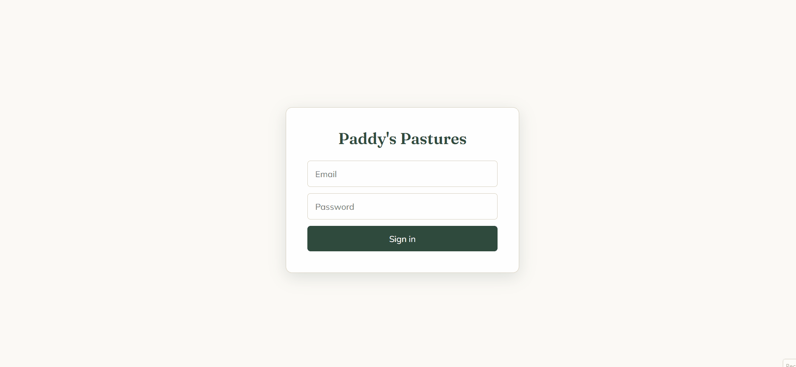

# Paddy's Pastures 🐴

A full-stack horse boarding management application built for a working horse barn to replace manual processes for horse care, boarder onboarding, and barn–owner communication.

**Live app:** https://paddyspasture.netlify.app/
**Status:** In production, actively used by a Florida horse boarding facility

---

## Overview

Paddy's Pastures is a role-based web application that gives a horse barn a single system to manage boarders, horse profiles, daily care tracking, and communication. It was built for a real client — a small barn where the owner and manager needed something genuinely simple to use, reliable, and secure.

The app supports three types of users, each with distinct permissions enforced at the database level:

- **Admins** (barn owner/manager) — full control over accounts, horse setup, and barn operations
- **Staff** — daily care tracking and communication with boarders
- **Boarders** (horse owners) — self-onboarding, managing their own horse's profile, and messaging the barn

---

## Key Features

- **Three-role permission system** enforced with PostgreSQL Row Level Security and database triggers
- **Admin-managed account creation** — no public sign-up; the barn creates accounts, and new users complete a guided first-login setup (set password, add contact info)
- **Boarder self-onboarding** — boarders create and complete their own horse profiles, which then lock for editing and hand off to the barn
- **Two-stage horse profiles** — boarders provide owner/horse details; admins fill barn-managed fields (stall, feeding, turnout) via a "new boarded horses" queue
- **Real-time messaging** — boarder-to-barn conversations with a shared staff inbox, powered by Supabase Realtime
- **Daily treatment checklist** — staff track daily care tasks per horse (done / N/A), with dated history and a "notify owner" email
- **File uploads** — horse photos (public) and medical records (private, access-controlled via signed URLs) through Supabase Storage
- **Printable horse info sheets** — clean, print-optimized per-horse care sheets for barn staff
- **Email & SMS notifications** — "in production" transactional email (Resend) and one-way SMS (Twilio) for barn communications

---

## Tech Stack

**Frontend**
- React (Vite)
- React Router

**Backend / Infrastructure**
- Supabase — PostgreSQL, Auth, Row Level Security, Edge Functions (Deno/TypeScript), Storage, Realtime
- Netlify — hosting & continuous deployment
- Resend — transactional email
- Twilio — SMS notifications

**Tooling**
- Supabase CLI for database migrations
- GitHub / GitHub Desktop for version control

---

## Architecture Highlights

These are the decisions I'm most proud of and that shaped the project:

### Security enforced at the database, not the UI

Permissions aren't just hidden buttons in the frontend — they're enforced in PostgreSQL itself. Row Level Security policies control which rows each role can read and write, and `SECURITY DEFINER` triggers guard sensitive operations (e.g. a boarder cannot change their own role or edit barn-managed fields, and a completed horse profile is locked at the database level). Even a hand-crafted request bypassing the UI is refused by the database.

### Incremental, validation-first delivery

The app evolved deliberately: a single-file HTML prototype → a Supabase-backed single-file app → a full Vite/React production application. Each stage validated the core idea with the client before adding infrastructure complexity, avoiding over-engineering ahead of confirmed needs.

### Division-of-labor data model

The two-stage horse profile (boarders provide their information; admins provide barn-managed fields) mirrors how the barn actually operates, rather than forcing one person to enter everything.

### Server-side operations via Edge Functions

Privileged actions — admin account creation, sending email/SMS — run in Supabase Edge Functions where secrets stay server-side and are never exposed to the browser.

---

## Gif

---

## Notes

Built as both a production application for a real client and a portfolio piece demonstrating full-stack development, database security, and end-to-end delivery.
